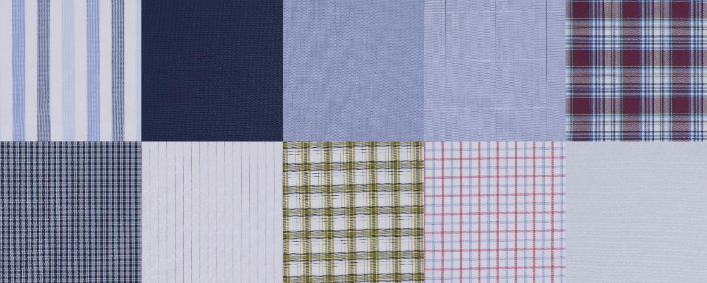
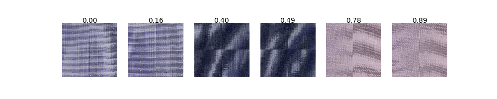

# Fabric Identification using CNN
This is my experiment **fabric identification** based on **[face recognition](https://github.com/davidsandberg/facenet)**.
My working modules mainly includes:
```
src/train_softmax.py # For train
contributed/get_emb_array.py # For top-n analysis
contributed/search_acc.py # For top-n analysis
src/validate_on_lfw.py # For threshold judgement
```

# Requirements
This project is runne with python2.7.12. Here are python requirements:
```
tensorflow==1.3.0
scipy
scikit-learn
opencv-python
h5py
matplotlib
Pillow
requests
```
Fabircs dataset should be organized with this structure:
```
/path/to/crop1600resize299
├── test
│   ├── A03031-1600080-1
│   │   ├── A03031-1600080-1_0000.jpg
│   │   └── A03031-1600080-1_0001.jpg
│   ├── A04033-1600003-3
│   │   ├── A04033-1600003-3_0000.jpg
│   │   └── A04033-1600003-3_0001.jpg
│   └── ...
├── train
│   ├── A004041-1701263-2
│   │   ├── A004041-1701263-2_0000.jpg
│   │   └── A004041-1701263-2_0001.jpg
│   ├── A03031-1600255-1
│   │   ├── A03031-1600255-1_0000.jpg
│   │   └── A03031-1600255-1_0001.jpg
│   └── ...
├── val
│   ├── A03031-1600080-1
│   │   ├── A03031-1600080-1_0000.jpg
│   │   └── A03031-1600080-1_0001.jpg
│   ├── A04033-1600003-3
│   │   ├── A04033-1600003-3_0000.jpg
│   │   └── A04033-1600003-3_0001.jpg
│   └── ...
```
Fabric images are look like this:


# Train
Start train is easy using this script:
```
$ sh ./train.sh
```

# Export embeddings and top-n analysis
```bash
export PYTHONPATH=src
$ python contributed/get_emb_array.py \
  --lfw_dir /media/wangx/HDD1/yarn-dyed-fabric/crop1600resize224/val \
  --model_dir /home/wangx/models/yarn-dyed-fabric/20171202-234221
```
    --lfw_dir: Directroy store test images
    --model_dir: Directroy checkpoint and meta files

It can output embeddings of test images to `.npy` file, and recording running time at the same time.
Then it will call `contributed/search_acc.py` module for **top-n analysis**.
As reference, here is executation time of my machine with Intel i5-6500, NVIDIA 1080 GPU:
> Export embedding time
> Forward pass 7978 images takes 48.93 seconds
> Forward pass 7978 images takes 48.84 seconds
> Forward pass 7978 images takes 48.14 seconds
>
> Search time
> It takes 248.58 seconds to search 7978 images
> It takes 244.38 seconds to search 7978 images
> It takes 229.45 seconds to search 7978 images

The output file like `20171202-234221_emb.npy` and `20171202-234221_emb_paths.txt` file can be used to show searched images. The way to use them is using `search_acc.py` module:
```python
>>> from contributed.search_acc import SearchFabric
>>> emb_array = '/path/to20171202-234221_emb.npy'
>>> paths = '/path/to20171202-234221_emb_paths.txt'
>>> search = SearchFabric(paths, emb_array)
>>> search.show_search(0)
```


# Evaluate performance
For **threshold judgement**, execute:
```
$ sh ./valid.sh
```

# Conclusion
The best performance appears when propressing fabric images by **crop 1600x1600 area then resize to 224**. As reference, my top-n analysis and `valid.sh` result of experiment are shown here:
```
# top-n analysis
The top 1 accuracy is 0.998871897719
The top 2 accuracy is 0.999623965906
The top 3 accuracy is 1.0
The top 4 accuracy is 1.0
The top 5 accuracy is 1.0
The top 6 accuracy is 1.0
The top 7 accuracy is 1.0
The top 8 accuracy is 1.0
The top 9 accuracy is 1.0
The top 10 accuracy is 1.0

# sh ./valis.sh
Accuracy: 1.000+-0.001
Validation rate: 0.99975+-0.00075 @ FAR=0.00126
Area Under Curve (AUC): 1.000
Equal Error Rate (EER): 0.000
```
